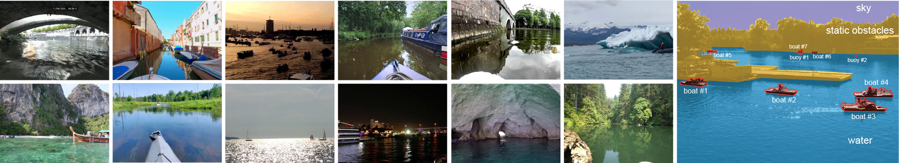

# LaRS Evaluator

[[`paper`](https://arxiv.org/abs/2308.09618)] [[`dataset`](https://lojzezust.github.io/lars-dataset)] [[`evaluation webserver`](https://macvi.org)] [[`BibTeX`](#cite)]


<p align="center">
    
    Examples of scenes in the LaRS benchmark.
</p>

This is the evaluator code for the paper "LaRS: A Diverse Panoptic Maritime Obstacle Detection Dataset and Benchmark" presented at ICCV 2023. It can be used to evaluate **semantic segmentation** and **panoptic segmentation** predictions with the LaRS ground-truth annotations. 

Currently only the GT of the *training* and *validation* sets is publicly available. For evaluation on the LaRS test set, please submit your submissions through [our evaluation server](https://macvi.org).

## Setup

1. Install requirements into your python environment
    ```bash
    pip install -r requirements.txt
    ```
2. For each of the evaluation tracks (semantic segmentation, panoptic segmentation) the evaluator expects a prediction root dir, where predictions will be placed.  
Configure paths to the dataset and predictions root in config files for your version of LaRS (*e.g.* [lars_val_semantic.yaml](configs/v1.0.0/lars_val_semantic.yaml)).

## Usage

1. Place the predictions of your methods into `<prediction_root_dir>/<method_name>`
    The method dir contains PNG files with predictions for all test images:
    - **Semantic segmentation**: The PNG file contains the predicted segmentation in RGB format, following the color coding of classes specified in the configuration file (*e.g.* [lars_val_semantic.yaml](configs/v1.0.0/lars_val_semantic.yaml)). By default this is:
        - sky: `[90,  75, 164]`
        - water: `[41, 167, 224]`
        - obstacle: `[247, 195,  37]`
        - Alternatively you may use the [lars_val_semantic_lbl.yaml](configs/v1.0.0/lars_val_semantic_lbl.yaml) config to evaluate predictions encoded as class ids (0 = obstacles, 1 = water, 2 = sky). Note, however, that the online evaluator expects predictions in the **color-coded format**.
    - **Panoptic segmentation**: The PNG file contains RGB coded class and instance predictions. The format follows LaRS GT masks: *class id* is stored in the **R** component, while *instance ids* are stored in the **G** and **B** components. 
2. Run evaluation:
    ```bash
    $ python evaluate.py path/to/config.yaml <method_name>
    ```

Result files with various statistics will be placed in the configured directory (`results/v1.0.0/<track>/<method>` by default).

## Result files

### Semantic segmentation

Results for semantic segmentation methods inlcude the following files:

- `summary.csv`: Overall results (IoU, water-edge accuracy, detection F1)
- `frames.csv`: Per frame metrics (number of TP, FP and FN, IoU, ...)
- `segments.csv`: Segment-wise results (TP coverage, FP area, FN area, ...)

### Panoptic segmentation

Results for semantic segmentation methods inlcude the following files:

- `summary.csv`: Overall results (PQ, RQ, SQ, semantic metrics)
- `frames.csv`: Per frame metrics
- `segments.csv`: Segment-wise results (TPs, FPs, FNs, areas, bboxes)
- `segments_agnostic.csv`: Segment-wise results for obstacle-class-agnostic case
- `segments_sem.csv`: Segment-wise results from semantic segmentation evaluation
- `obst_csl.csv`: Matched segments (GT and pred) categories and IoU -> for confusion matrix
- `obst_cls_agnostic.csv`: Matched segments categories and IoU for obstacle-class-agnostic case

## <a name="cite"></a>Citation

If you use LaRS, please cite our paper.

```bibtex
@InProceedings{Zust2023LaRS,
  title={LaRS: A Diverse Panoptic Maritime Obstacle Detection Dataset and Benchmark},
  author={{\v{Z}}ust, Lojze and Per{\v{s}}, Janez and Kristan, Matej},
  booktitle={International Conference on Computer Vision (ICCV)},
  year={2023}
}
```
